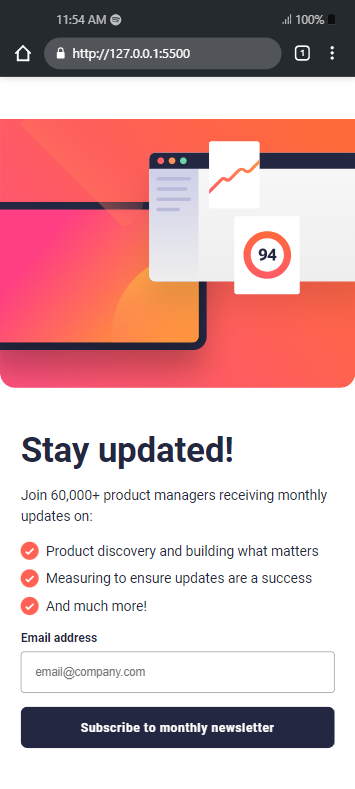
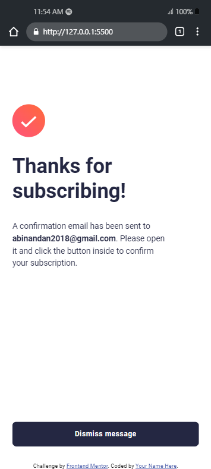
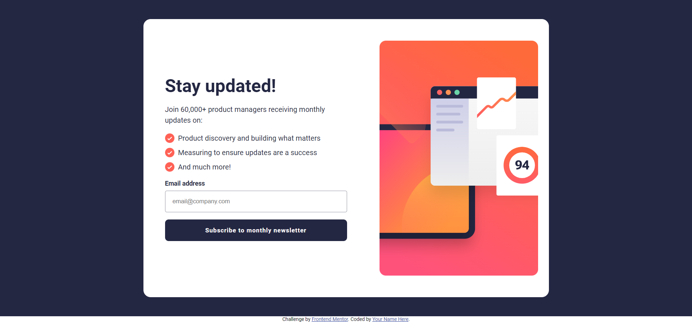
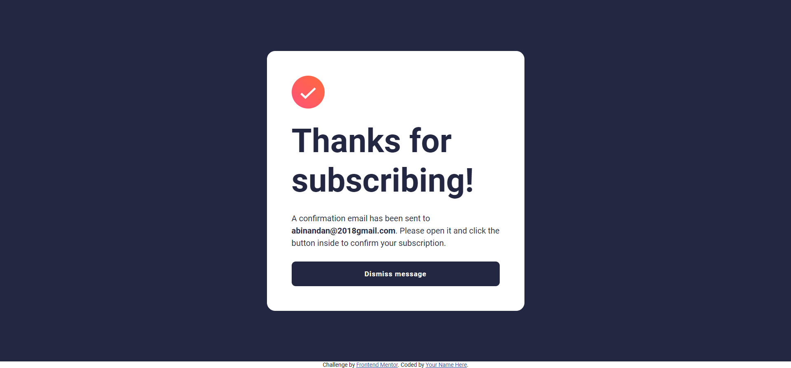
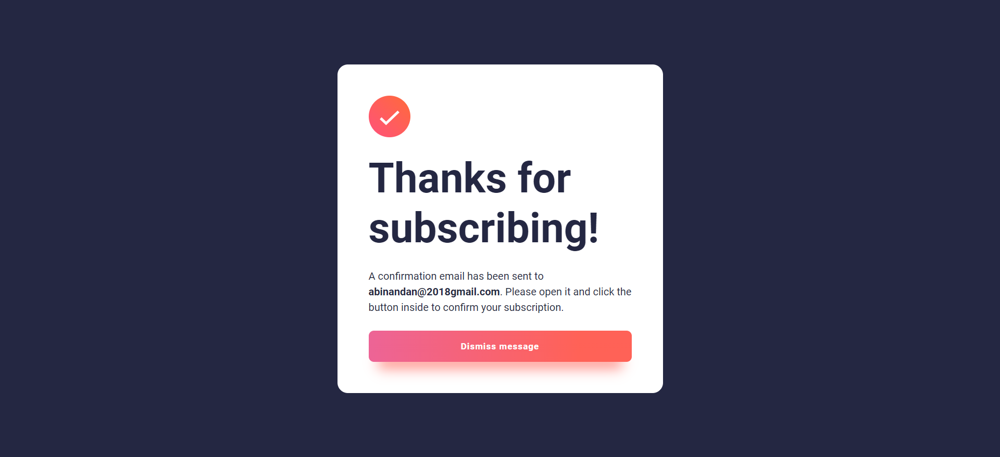
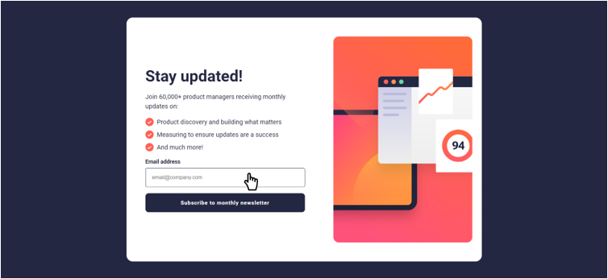
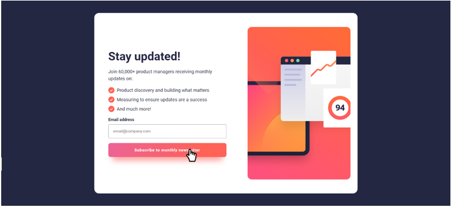

# Frontend Mentor - Newsletter sign-up form with success message solution

This is a solution to the [Newsletter sign-up form with success message challenge on Frontend Mentor](https://www.frontendmentor.io/challenges/newsletter-signup-form-with-success-message-3FC1AZbNrv). Frontend Mentor challenges help you improve your coding skills by building realistic projects.

## Table of contents

- [Overview](#overview)
  - [The challenge](#the-challenge)
  - [Screenshot](#screenshot)
  - [Links](#links)
- [My process](#my-process)
  - [Built with](#built-with)
  - [What I learned](#what-i-learned)
  - [Continued development](#continued-development)
  - [Useful resources](#useful-resources)
- [Author](#author)
- [Acknowledgments](#acknowledgments)

## Overview

### The challenge

Users should be able to:

- Add their email and submit the form
- See a success message with their email after successfully submitting the form
- See form validation messages if:
  - The field is left empty
  - The email address is not formatted correctly
- View the optimal layout for the interface depending on their device's screen size
- See hover and focus states for all interactive elements on the page

### Screenshot

- Mobile Design



- Mobile Success



- Desktop Design



- Desktop Success



- Desktop Success Active



- Error States


- Active States 1



- Active States 2



Add a screenshot of your solution. The easiest way to do this is to use Firefox to view your project, right-click the page and select "Take a Screenshot". You can choose either a full-height screenshot or a cropped one based on how long the page is. If it's very long, it might be best to crop it.

Alternatively, you can use a tool like [FireShot](https://getfireshot.com/) to take the screenshot. FireShot has a free option, so you don't need to purchase it.

Then crop/optimize/edit your image however you like, add it to your project, and update the file path in the image above.

### Links

- Live Site URL: [Add live site URL here]

## My process

### Built with

- Custom CSS
- Flexbox
- CSS Grid
- Mobile-first workflow (Media Queries)
- Vanilla JavaScript
- FormData API

### What I learned

I learnt to setup regular expression for validating email:

```js
// VALIDATE EMAIL
const regexPattern = /^[^\s@]+@[^\s@]+\.[^\s@]+$/;
const regex = new RegExp(regexPattern);
if (regex.test(email)) {
  newsletterMain.classList.remove("show-main");
  successMessageMain.classList.add("show-main");
  emailSpan.textContent = email;
} else {
  // SET ERROR MESSAGES & STYLES
  formInput.classList.add("error-form-input");
  errorMessage.classList.add("show-message");
}
```

If you want more help with writing markdown, we'd recommend checking out [The Markdown Guide](https://www.markdownguide.org/) to learn more.

## Author

- Website - [Abinandan A T](https://my-portfolio-1z8s.onrender.com/)
- Frontend Mentor - [@Abinandan1](https://www.frontendmentor.io/profile/Abinandan1)
